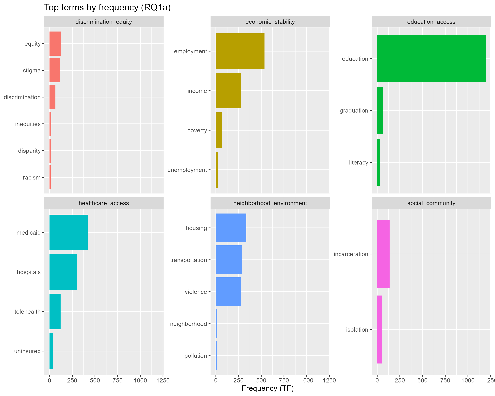
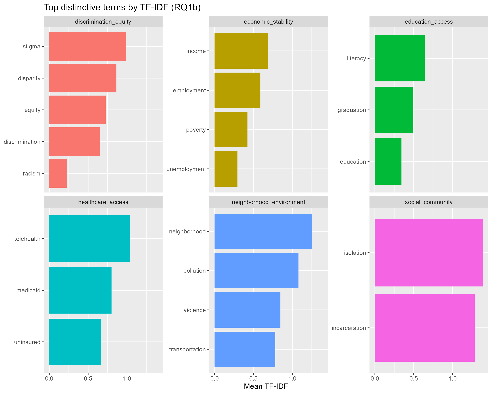
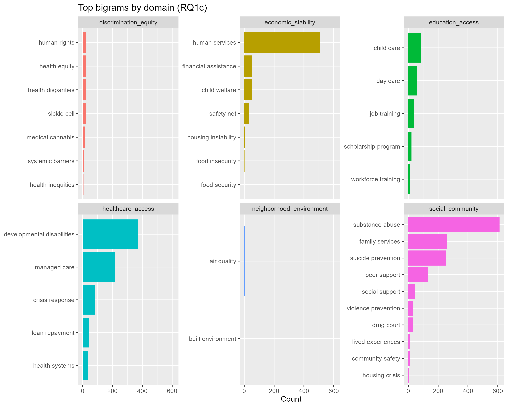
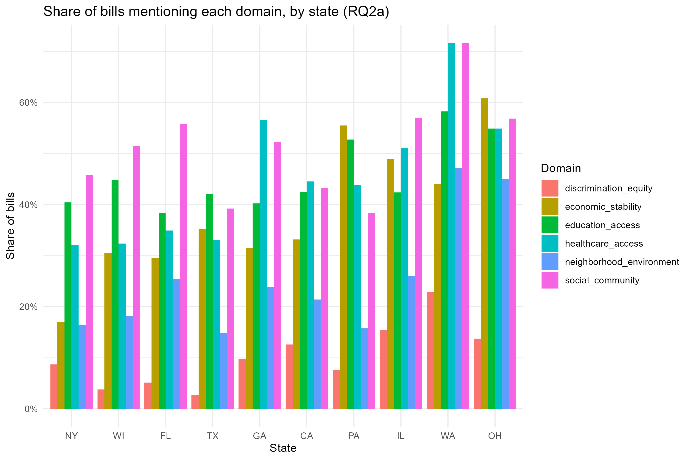
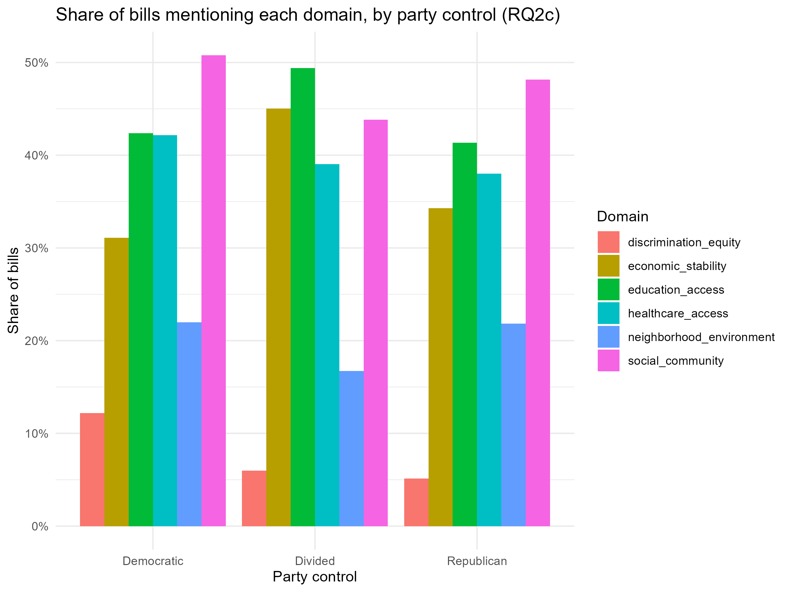
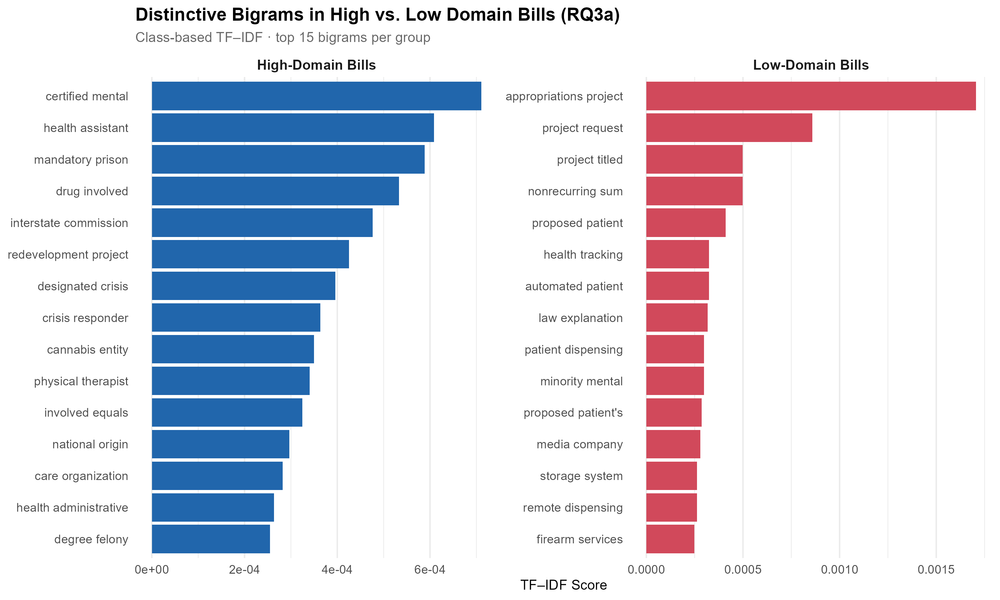
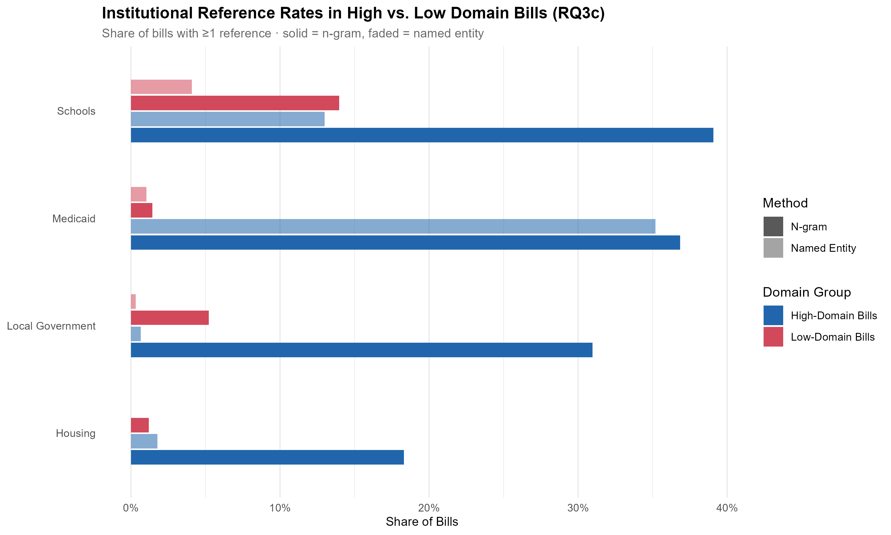
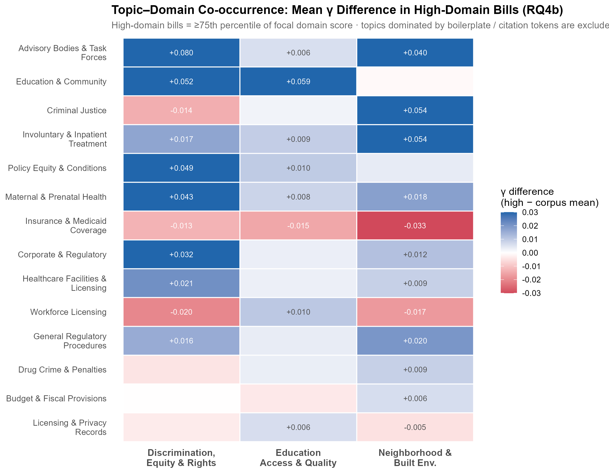

# Introduction

The social determinants of health (SDOH) represent the fundamental environmental, social, and economic conditions in which individuals are born, grow, live, work, and age that shape their overall well-being and health outcomes [@kirbySOCIALDETERMINANTSMENTAL; @SocialDeterminantsHealtha]. While these determinants influence both physical and psychological health, the core domains particularly relevant to mental health and this study include economic stability, education access and quality, health care access and quality, neighborhood and built environment, social and community context, and discrimination, equity, and rights [@SocialDeterminantsHealtha; @kirbySOCIALDETERMINANTSMENTAL]. Crucially, experiences of disadvantage follow a distinct social gradient, meaning that individuals occupying lower social positions face compounding mental health risks that accumulate over the life course through persistent exposure to chronic stress and structural inequities [@alegriaSocialDeterminantsMental2018].

These foundational factors function as upstream drivers, acting as the fundamental causes that shape downstream living conditions and immediate health risks [@alegriaSocialDeterminantsMental2018]. Consequently, effectively addressing mental health requires a critical shift away from focusing exclusively on individual pathology and biomedical models of disease, moving instead toward an examination of the systemic inequities and structural conditions that generate psychological distress [@kirbySOCIALDETERMINANTSMENTAL]. While individual-level clinical interventions are important, public policy serves as an important mechanism for shaping these overarching environmental and socioeconomic conditions [@kirbySOCIALDETERMINANTSMENTAL; @gostinLegalDeterminantsHealth2019]. By establishing rules, structuring societal systems, and directing the equitable distribution of resources, the law can directly mediate these upstream social determinants, providing an important tool to restructure societal frameworks and facilitate a healthier, more equitable society [@kirbySOCIALDETERMINANTSMENTAL; @gostinLegalDeterminantsHealth2019].

Despite widespread recognition of the critical importance of the SDOH, existing scholarship does not systematically map how state mental health bills address these specific domains across varying legislative and political contexts. This gap persists largely because the current literature is dominated by qualitative examples and narrow case studies that, while providing deep insights, cannot easily capture broad structural trends. These legal texts create a methodological challenge because they consist of large volumes of unstructured language that are difficult to analyze systematically through manual review [@grimmerTextDataPromise2013].

By leveraging text-as-data computational techniques, researchers can extract meaningful patterns from large-scale legislative corpora that were previously difficult to process systematically at scale [@grimmerTextDataPromise2013]. In this study, legislative attention refers to the extent and pattern of social determinant language observed in state mental health bill texts. To address the current gap in the literature, this study maps legislative attention to the social determinants of mental health in a LegiScan-derived, keyword-filtered corpus of introduced state mental health bills from ten states between 2021 and 2024, comparing patterns across domains, states, session years, and party control.

# Literature review

Mental health is shaped not only by clinical care and individual risk factors, but also by upstream social, economic, and environmental conditions. A substantial body of evidence demonstrates that experiences of socioeconomic disadvantage--including poverty, unemployment, housing instability, social exclusion, and unsafe physical environments--are consistently linked to worse mental health outcomes and higher rates of psychiatric illness [@kirbySOCIALDETERMINANTSMENTAL]. Because these foundational determinants influence an individual's health and well-being through diverse, interacting pathways across the lifespan, utilizing a domain-based lens that categorizes these factors into distinct areas like economic stability, neighborhood and built environment, and social and community context provides a highly useful framework for understanding and addressing them [@SocialDeterminantsHealtha].

A domain-based framework is useful because the social-determinants literature groups upstream influences into recurring categories rather than treating them as one undifferentiated factor. For instance, the Healthy People 2030 initiative organizes these conditions into five distinct domains: Economic Stability, Education Access and Quality, Health Care Access and Quality, Neighborhood and Built Environment, and Social and Community Context [@SocialDeterminantsHealtha]. These broad categories naturally map onto themes already visible in the mental health literature, where researchers consistently link psychiatric outcomes to specific upstream factors like income and job insecurity, poor education, limited care access, housing instability, and lack of social support or exposure to violence [@kirbySOCIALDETERMINANTSMENTAL]. Furthermore, systemic discrimination, health equity, and human rights deserve explicit attention in mental-health-focused studies because experiences of social exclusion, structural racism, and stigma act as fundamental causes of psychological distress that compound vulnerabilities across all other domains [@kirbySOCIALDETERMINANTSMENTAL; @whitmanAddressingSocialDeterminants].

If social determinants shape mental health, then law and public policy are important mechanisms through which governments structure those conditions. Through statutory and regulatory frameworks, the law directly affects the operations of public and private institutions, dictates the equitable or inequitable distribution of resources, and shapes both eligibility for and the delivery of health services [@gostinLegalDeterminantsHealth2019]. Because of its pervasive influence, policy possesses a dual potential: it can either actively reduce harm by building strong health systems, or it can reproduce social exclusion and entrench stigma [@gostinLegalDeterminantsHealth2019]. Poorly designed or punitive laws can institutionalize inequality and create systemic barriers that discourage marginalized populations from seeking treatment [@gostinLegalDeterminantsHealth2019]. Consequently, legislative language matters immensely because policy texts do more than merely record objective administrative actions; the specific wording used actively frames societal problems, conceptualizes target populations, and signals governmental priorities and approaches to intervention [@popaModellingPolicyAction2025]. 

Existing state-level mental health scholarship suggests that attention to social determinants is real but uneven across domains and jurisdictions. As Rotter and colleagues demonstrate, state mental health authorities display broad recognition and concern regarding the relevance of social determinants, yet this awareness suffers from a lack of standardized approaches and limited intentional implementation of specific screening tools or intervention mandates [@rotterSocialDeterminantsMental2022]. Moreover, programmatic focus is highly skewed; some determinants--especially housing instability and health care access and quality--receive significantly more attention and targeted action than other crucial factors such as education, food insecurity, and discrimination, equity, and rights [@rotterSocialDeterminantsMental2022]. Consequently, this variation across states is substantively meaningful and not merely a data convenience, as these diverging regional priorities create profound inequities and dictate fundamentally different lived experiences within the mental health system depending on where an individual resides [@nelsonStatePoliciesThat2022]. 

Although prior scholarship shows that social determinants matter for mental health and that law helps structure those conditions, less is known about how state mental health bills systematically express these concerns across domains and contexts. While the existing literature thoroughly explains why SDOH matter for overall well-being and why public policy is a crucial mechanism for addressing structural health inequities [@kirbySOCIALDETERMINANTSMENTAL], current research does not fully map domain-specific language across a comprehensive, multi-stage bill corpus [@nelsonStatePoliciesThat2022]. Furthermore, variation across states, session years, and party control--such as shifts in interparty competition, electoral turnover, and differing regional governance--are highly plausible and important factors in shaping public policy [@takedaDeterminantsImplementationState1987], but they are still underexamined in this specific legislative-text context [@popaModellingPolicyAction2025]. To address this critical gap, this study contributes to the field by mapping social determinant language in state mental health bills across domains, states, session years, and party control.

# Conceptual framework

Because law can greatly affect the social determinants of mental health, state policy is an important site for understanding how governments respond to those conditions. This project treats state mental health bills as institutional signals of which social determinants receive legislative attention. Bill text serves as the observable link between scholarship on social determinants and measurable patterns of legislative attention. The analysis compares these patterns across states, session years, and party control, with the goal of mapping policy attention rather than estimating downstream mental health outcomes.

{#fig-framework width="100%"}

# Research questions

RQ1. How frequently do state mental health bills mention specific social determinant domains, and which domains are most prominent?

- RQ1a. Which domain terms are most frequent by TF?
- RQ1b. Which terms are most distinctive by TF-IDF?
- RQ1c. Which bigrams and trigrams recur most often within each domain?

RQ2. How does the use of social determinant domain language vary by state, session year, and party control?

- RQ2a. Which states use the highest share of neighborhood and built environment or discrimination, equity, and rights language?
- RQ2b. Does domain language increase or decrease over time?
- RQ2c. Are certain domains more common under Democratic, Republican, or divided control?

RQ3. What terms, phrases, and named entities distinguish bills with high versus low levels of social determinant language?

- RQ3a. Which words and phrases are most distinctive in high-domain bills?
- RQ3b. Which organizations, agencies, programs, or place names appear most often in high-domain bills?
- RQ3c. Do high-domain bills reference schools, housing authorities, Medicaid, or local governments more often than low-domain bills?

RQ4. What latent themes emerge in mental health bills, and how do those themes relate to concrete social determinant domains?

- RQ4a. Which topics are most common in the corpus?
- RQ4b. Which topics co-occur with high neighborhood and built environment, education access and quality, or discrimination, equity, and rights scores?
- RQ4c. Do some states or session years show stronger topic-domain combinations than others?

# Methodology

## Data collection and corpus construction

This study analyzes introduced state legislative bills from ten U.S. states (New York, Illinois, Texas, Florida, California, Pennsylvania, Washington, Georgia, Wisconsin, and Ohio) across regular sessions from 2021–2024. Bills and metadata were drawn from LegiScan’s public historical API JSON archives, and the corpus was restricted to introduced versions to ensure comparability at a common legislative stage. Mental-health-relevant bills were identified by applying a fixed keyword screen to bill titles and descriptions, reducing the candidate pool to 3,395 bills. For these bills, full text was retrieved using the LegiScan API getBillText endpoint, converted to UTF-8 plain text using format-appropriate Python scripts, and validated through automated checks and manual spot-reviews. After excluding special sessions and non-bill records, the final analytic corpus consists of 3,169 introduced bills paired with metadata.

## Data preparation

Two contextual variables—session year and party control—were prepared for subgroup comparisons in RQ2 and descriptive stratification throughout the analysis. Session year was coded as the start year of the regular legislative session in which the bill was introduced (2021 or 2023), and party control at session opening was classified as Democratic trifecta, Republican trifecta, or divided government using National Conference of State Legislatures and Ballotpedia data.

From the master corpus table, the analysis constructs a set of derived tables used across the research questions: (1) a token table for unigram-based frequency and TF–IDF analysis, (2) an n-gram table for bigram and trigram analysis, (3) a named-entity table for organization and place extraction, (4) a domain dictionary table for SDOH measurement, and (5) a topic table of document–topic proportions for RQ4. All text processing was implemented in R using the tidytext workflow for tokenization and document-term representations, with spacyr used for named entity recognition (NER) via spaCy’s English model.

Preprocessing decisions were tailored to the measurement task. For dictionary scoring, n-grams, and NER, the analysis uses raw, unstemmed tokens to preserve interpretability and to avoid breaking exact dictionary phrase matches and entity boundaries. For TF–IDF and topic modeling, the analysis uses a more normalized representation (lemmatized tokens) to reduce sparsity of word variants and to better capture recurring themes across documents.

Tokenization followed a conservative cleaning strategy designed for legislative text: standard stopwords (tidytext’s stop word lexicon) were removed, pure numbers and very short tokens were excluded, and a custom legislative stopword list was applied iteratively to remove high-frequency procedural boilerplate (e.g., “section,” “chapter,” “subsection,” “shall”) that is ubiquitous in bills but not substantively informative. For phrase analysis, bigrams and trigrams were constructed and filtered to exclude any n-grams containing stopwords or numeric tokens; a small additional list of formatting artifacts (e.g., markup language produced during bill drafting or PDF extraction) was also removed to prevent document-format conventions from dominating substantive phrase patterns.

## Dictionary construction and bill-level measures

To operationalize “legislative attention” to upstream determinants, this study uses a custom domain dictionary that maps bill language to six social-determinant domains relevant to mental health: Economic Stability; Education Access and Quality; Health Care Access and Quality; Neighborhood and Built Environment; Social and Community Context; and Discrimination, Equity, and Rights. Dictionary methods are appropriate for this purpose because they provide a transparent, deductive measurement strategy in which concept definitions are specified beforehand and then applied consistently across a large corpus [@grimmerTextDataPromise2013].

Dictionary development combined (1) deductive term selection from the social-determinants literature and the Healthy People 2030 SDOH framework and (2) an inductive validation pass using a 30-bill sample from the corpus to identify additional domain-relevant language and to remove ambiguous or overly generic terms. Candidate terms were retained only if they met two substantive criteria: (a) the term clearly referred to a social condition, structural factor, or population characteristic (rather than a clinical outcome or purely procedural legislative language), and (b) its presence plausibly distinguished a bill as addressing an upstream determinant rather than generic mental-health service delivery. As a result, several intuitively related but overly ubiquitous terms (e.g., broad healthcare terms that appear in nearly all mental-health bills) were avoided to reduce false positives and preserve domain specificity.

Dictionary matching was performed on raw, unstemmed tokens to preserve interpretability and to avoid breaking exact phrase matches (e.g., “safety net,” “structural racism”). Unigram matching was performed against the token table, while bigram and trigram matching was performed against the n-gram tables.

Dictionary matches were aggregated into three bill-level measures that serve as inputs to the research questions:
(1) Domain indicators (binary): For each domain, a bill was coded as mentioning that domain if it contained at least one matching dictionary term or phrase. These indicators are the basis for subgroup comparisons in RQ2, where results are reported as shares of bills within each subgroup (state, session year, or party-control category) rather than raw counts, to ensure comparability across groups of unequal size.
(2) Domain scores (counts): For each domain, a bill received a domain score equal to the count of unique dictionary terms/phrases from that domain observed in the bill text. Using unique-term counts (rather than total occurrences) reduces the influence of repetitive drafting language and better reflects the breadth of domain-relevant content in a bill.
(3) Overall “domain intensity” score: For analyses that require a single summary measure of upstream focus, each bill received a total domain score equal to the sum of unique matched dictionary terms across all domains.

Importantly, domain categorization was non-exclusive: a single bill can match multiple domains, consistent with the fact that comprehensive mental health legislation may address several upstream determinants simultaneously.

## RQ1: Domain prominence and recurring expressions

To address RQ1, the analysis combines dictionary filtering with unigram and n-gram frequency measures. First, dictionary terms and phrases were linked to the token and n-gram tables (unigrams via the token table; bigrams/trigrams via the n-gram table). For RQ1a, domain-term prominence is summarized using term frequency (TF), operationalized as the total count of each dictionary term across the corpus (i.e., summing token counts across bills). For RQ1b, term distinctiveness is summarized with TF–IDF, treating each bill as a separate document so that terms frequent in a small subset of bills are up-weighted relative to terms that occur broadly across the corpus. For RQ1c, recurring phrases are measured using bigrams and trigrams constructed from bill text and then summarized as the most frequent domain-matched n-grams within each domain.

## RQ2: Variation by state, session year, and party control

To address RQ2, the primary outcome is the bill-level domain indicator from the dictionary scoring stage. Comparisons are reported as shares (proportions) within each subgroup—e.g., the share of bills in a given state-session or party-control category that mention a domain—rather than raw counts, to ensure comparability across groups of unequal size.

## RQ3: High- vs. low-domain bills and named entities

To address RQ3, bills were first ranked by the overall domain intensity score. Bills above the 75th percentile of the score distribution were defined as high-domain, and bills below the 25th percentile were defined as low-domain. Distinctive language was then identified using three complementary approaches. First, unigrams and n-grams were compared across the high- vs. low-domain subsets using class-based TF–IDF, treating the high-domain subset as one aggregated document and the low-domain subset as another, to identify terms distinctive to high-domain bills relative to low-domain bills. Second, recurrent bigrams and trigrams were compared using the same contrastive logic to identify short policy-relevant expressions that separate the two groups. Third, NER was used to extract organizations and geopolitical entities that function as concrete institutional or place-based signals in high-domain bills (e.g., agencies, programs, state departments). NER was executed with spacyr/spaCy's en_core_web_lg English model and then cleaned through iterative inspection of the most frequent entities; generic procedural artifacts were removed using a custom entity stoplist. The spaCy LAW entity type was excluded because it predominantly captured internal legislative cross-references and formatting artifacts rather than substantively meaningful named laws, yielding insufficient signal for comparison.

## RQ4: Topic modeling and domain co-variation

To address RQ4, the analysis fit an LDA topic model to the corpus using a document-term matrix derived from the cleaned token table. Because topic models are sensitive to sparsity and high dimensionality, the topic-model input uses a more normalized representation (lemmatized tokens) than the dictionary and n-gram components. The number of topics was selected as k=20 based on (1) perplexity comparisons across candidate values (k $\in$ {10,15,20,25,30}) and (2) substantive inspection of the top terms per topic to ensure interpretability. The fitted model produces document–topic proportions ($\gamma$) for each bill, which were then joined back to bill metadata and domain scores to examine which topics are most prevalent overall and how topic prevalence co-varies with domain indicators/scores across states and session years. Six topics were identified as procedural/formatting artifacts (state-specific header language, citation conventions, and extraction remnants) and were excluded from substantive RQ4 comparisons.

# Findings

## RQ1

The most frequent dictionary-filtered domain word among introduced bills is education (tf = 1,197), followed by employment (535), medicaid (420), housing (336), hospitals (302), transportation (290), income (277), and violence (276). All of these terms appear in the education access, economic stability, healthcare access, and neighborhood-environment domains. By contrast, terms from the discrimination-equity domain are less frequent, with equity (tf = 127), stigma (tf = 115), and discrimination (tf = 65) as the domain's most frequent terms, while social-community words also have only modest frequency with incarceration (tf = 136) and isolation (tf = 54).

{#fig-rq1a-tf width=65%}

TF-IDF scores highlight a somewhat different pattern: within healthcare access, telehealth (mean TF-IDF = 1.04) and uninsured (0.66) are especially distinctive, and in neighborhood-environment, neighborhood (1.25), pollution (1.08), and violence (0.85) stand out despite not being the most frequent raw tokens. Discrimination-equity terms such as stigma (0.99), disparity (0.86), and equity (0.72), along with social-community terms like isolation (1.39) and incarceration (1.28), also emerge as highly distinctive to the subset of bills that reference them.

{#fig-rq1b-tfidf width=65%}

Phrase-level patterns reinforce these findings. The most common bigrams are substance abuse (612 occurrences), human services (508), and developmental disabilities (369), which appear in the social-community, economic stability, and healthcare access domains, respectively. The most common trigrams are behavioral health services (241), health care provider (189), and law enforcement agency (180), of which the first two are in the healthcare access domain and the last is in the social-community domain.

{#fig-rq1c-bigrams width=65%}

## RQ2

State-level comparisons show that, of all states, Washington exhibits the highest shares of bills mentioning most domains, including neighborhood and built environment (0.47) and discrimination, equity, and rights (0.23).

{#fig-rq2-state width=65%}

Across the 2021 and 2023 sessions, domain shares remain relatively stable: education access language rises only slightly from 0.42 to 0.43 of bills, economic stability from 0.328 to 0.332, and healthcare access from 0.40 to 0.42, while social-community references dip modestly from about 0.51 to 0.48. Discrimination-equity and neighborhood-environment mentions show similarly small shifts (roughly 0.11 to 0.09 and 0.22 to 0.21, respectively), suggesting no dramatic reorientation of domain emphasis over the study window. 

By party control, divided governments have the highest shares of bills mentioning economic stability (about 45 percent) and education access (about 49 percent), whereas Democratic trifecta states show the highest shares for healthcare access (0.42), neighborhood and built environment (0.22), social-community context (0.51), and discrimination-equity language (0.12). However, Republican trifectas are not far behind on healthcare access (0.38), neighborhood and built environment (0.22), and social-community context (0.48), and they have a slightly higher share of economic stability mentions (0.34) than Democratic trifectas (0.31).

{#fig-rq2-party width=65%}

## RQ3

To examine how language differs between bills with higher and lower SDOH intensity, I computed class-based TF-IDF for unigrams and bigrams in the high- and low-domain bill groups. High-domain unigrams skew toward broad policy language, including terms such as equity, sanction, prisoner, and hiv. In contrast, low-domain unigrams are more idiosyncratic and proper-noun-like, with examples including welch, emanuel, chris, and tamms, alongside niche medical or procedural terms like hyperbaric, psychosurgical, and mastectomy. 

As with unigrams, high-domain bigrams are coherent and policy-relevant, with examples such as certified mental, health assistant, mandatory prison, and designated crisis. Together, these bigrams highlight service delivery and justice or public-safety interfaces around mental health, such as crisis response and prison settings. In contrast, low-domain bigrams are dominated by procedural and fiscal language like appropriations project, project request, and project titled. Overall, high-domain bills show more substantively coherent SDOH-related language in both unigrams and bigrams, whereas low-domain bills mix project- and appropriations-oriented language with idiosyncratic proper nouns and medical terms.

{#fig-rq3a-distinctive width=65%}

To answer RQ3b, I compared organization (ORG) and geopolitical (GPE) entities between high- and low-domain bills using spaCy NER. I then plotted the top ORGs by total mentions per group, computed high:low mention ratios for ORGs appearing in both groups, and plotted the most frequent GPEs. In the first plot, I found that high-domain bills consistently reference state departments (e.g., Department of Public Health) and public insurance programs (e.g., Medicaid) that directly administer or finance mental health and SDOH-related services. Low-domain bills, by contrast, highlight codes and generic bodies (e.g., The Task Force) rather than specific service agencies or payers. Surprisingly, the top low-domain "ORG" is a statute reference (Health and Safety Code), not an organization, illustrating NER misclassification. 
The second plot shows that when these agencies, payers, and program or act names appear at all, they are overwhelmingly concentrated in high-domain bills, with high:low ratios on the order of tens or even hundreds to one. 

In the GPE plot, both panels are dominated by state and federal references, with only modest differences: high-domain bills reference multiple large states and federal context, while low-domain bills lean slightly more on New York-centered internal references. Overall, high-domain bills disproportionately mention public payers and state health and human-services agencies, whereas low-domain bills instead emphasize statutory codes and task forces, with more NER artifacts.

To answer RQ3c, I compared institutional reference rates for four categories—Schools, Medicaid, Local Government, and Housing—in high- vs. low-domain bills using both n-gram pattern matching and entity-based matching (spaCy ORG/GPE; see @fig-rq3c-reference). Both methods agree that Medicaid references are dramatically more common in high-domain bills and that schools are mentioned about two to three times as often in high-domain bills as in low-domain bills. N-grams also show a clear gap for local government and housing, with high-domain bills much more likely to reference these institutions, while entity-based detection is sparse for these categories, suggesting local-government and housing references are often embedded in phrases that NER does not tag cleanly. Across all four categories, high-domain bills have higher institutional reference rates than low-domain bills, most strikingly for Medicaid and schools.

{#fig-rq3c-reference width=65%}

## RQ4

To answer RQ4a, I used an LDA model to estimate document–topic proportions and examined both mean topic prevalence and dominant-topic counts. The most prevalent topics are Education & Community, Advisory Bodies & Task Forces, Insurance & Medicaid Coverage, Criminal Justice, and Workforce Licensing, and together these cover roughly two thirds of bills as their dominant topics. The distribution is highly concentrated rather than flat, and explicitly clinical-care or facility-licensing topics sit near the bottom of the prevalence rankings.

To answer RQ4b, I compared topic proportions with SDOH domain scores and produced a topic–domain heatmap of alignment (mean document–topic proportion differences between high-domain bills and the full corpus; see @fig-rq4b-topic). For Discrimination, Equity & Rights, the strongest alignment is with Advisory Bodies & Task Forces, with secondary alignment in Education & Community and Policy Equity & Conditions. For Education Access & Quality, the Education & Community topic shows the strongest positive alignment, providing a face-validity check that education-domain language concentrates in the education-themed topic. For Neighborhood & Built Environment, the strongest alignments are with Criminal Justice and Involuntary & Inpatient Treatment, with secondary alignment in Advisory Bodies & Task Forces. Cross-domain, Advisory Bodies & Task Forces and Involuntary & Inpatient Treatment show positive alignment across multiple domains, while Insurance & Medicaid Coverage shows negative alignment for all three focal domains, meaning that bills most strongly framed around education, equity, or neighborhood SDOH tend to devote less text to insurance and payer language than the corpus average.

{#fig-rq4b-topic width=65%}

To address RQ4c, I started by creating a year trend plot, which shows that all four SDOH-focal topics—Education & Community, Criminal Justice, Insurance & Medicaid Coverage, and Policy Equity & Conditions—are present in each session year and change only gradually over time. Mean topic proportions increase slightly from 2021 to 2023, but there is no sharp break or reversal, suggesting incremental rather than dramatic growth in SDOH framing over this short window.

At the state level, the heatmaps and state-domain interaction plot show that several topics are represented in every state, but some states emphasize certain topics more than others. Texas, for instance, emphasizes Education & Community and Workforce Licensing far more, whereas Washington focuses on Involuntary & Inpatient Treatment. No pattern of geographic size, region, or party control emerges from the data; every state seems to have its own unique topic emphasis pattern.

# Discussion

## Interpreting SDOH domain attention (RQ1 + RQ2)

Across RQ1 and RQ2, the results show that SDOH language in state mental health bills is unevenly distributed across domains, but that each domain has both high-frequency and more specialized terms. In RQ1a and RQ1c, the most frequent unigrams and bigrams tend to come from every domain except discrimination, equity, and rights, but each domain also contains less common terms such as literacy, neighborhood, and health equity that occur relatively rarely. RQ1b shows that several of these lower-frequency terms, including literacy in education access, neighborhood and pollution in neighborhood-environment, and stigma and disparity in the discrimination-equity domain, have high mean TF-IDF scores, indicating that they are distinctive when they appear and tend to cluster in particular bills rather than diffusing across the corpus. Taken together, these patterns suggest that while all six domains are represented and share a mix of common and specialized language, some aspects of SDOH enter mental health legislation through more targeted, bill-specific vocabulary rather than broad, ubiquitous terms.

RQ2 adds that domain attention also varies systematically by state and party control. Across states and party-control types, discrimination, equity, and rights and neighborhood and built environment consistently appear among the lowest-share domains, whereas education access and quality, health care access and quality, and social and community context are more routinely mentioned, even though their specific terms and phrases differ by context. These descriptive patterns indicate that both state context and partisan control align with different emphases within a shared SDOH framework, but neither factor alone fully explains cross-state variation in which domains are prominent in mental health bills.

## High- vs. low-domain bills (RQ3)

The high- versus low-domain contrast in RQ3 shows that SDOH intensity is tied to different kinds of distinctive bill language: high-domain bills pair SDOH language with justice, crisis-response, and service-system terms, whereas low-domain bills concentrate on project scaffolding and narrow technical or locality-specific details. These patters suggest that high-domain bills are engaging more directly with problems, sanctions, and conditions, rather than narrow procedural detail, while low-domain bills lack that central focus and are often anchored in specific projects, appropriations, locations, or medical technologies rather than a general SDOH framing.

These lexical differences are mirrored in the institutional references that appear most often in each group. High-domain bills invoke public payers and state health and human-services agencies far more often than low-domain bills, which instead highlight generic task forces and statutory code labels. Geopolitical entities, in contrast, show few differences between high- and low-domain bills, suggesting that place-based language is common across the corpus and does not meaningfully differentiate SDOH intensity. Finally, the institutional reference comparison for specific categories (Schools, Medicaid, Local Government, Housing) shows that high-domain bills are much more likely to reference the institutions, underscoring that SDOH-intensive legislation is tightly connected to key service and governance actors.

## Topics and domains together (RQ4)

The topic model results of RQ4a indicate that most introduced state mental health bills cluster around a small set of institutional and systems-oriented themes rather than being evenly distributed across many topics. Linking topics to SDOH domain scores shows that education access and quality aligns cleanly with the Education & Community topic, discrimination, equity, and rights aligns most strongly with Advisory Bodies & Task Forces and Policy Equity & Conditions, and neighborhood and built environment aligns with Criminal Justice and Involuntary & Inpatient Treatment, with advisory bodies again playing a supporting role. Advisory Bodies & Task Forces and Involuntary & Inpatient Treatment therefore play cross-domain roles, appearing more often in bills with high education, neighborhood, and equity scores. It also suggests that concerns about these domains are often routed through commissions, task forces, and procedural mechanisms, with justice-system and involuntary-treatment provisions incorporated as well. Also notable is that the Insurance & Medicaid Coverage topic shows negative alignment with all three focal domains, indicating that bills framed most strongly around education, equity, or neighborhood SDOH tend to devote less text to insurance and payer language than the corpus average. Finally, the results of RQ4c show plainly that there is no clear pattern of topic-domain alignment by state or session year, leaving it unclear what factors drive topic emphasis.

Taken together, the first two RQs suggest that state mental health bills most often frame upstream determinants through education, health care access, and social and community context, while discrimination, equity, and neighborhood conditions appear less frequently. The next RQ adds on to this picture by suggesting that bills with more SDOH language do indeed seem to have a greater focus on topics relevant to social determinants, particularly service delivery and justice-system interfaces. But RQ4 indicates that, at least in some domains, having more SDOH language can actually be associated with less emphasis on insurance and Medicaid coverage. Legislatures and advocates aiming to advance mental health equity could use these patterns to press for more routine incorporation of equity and neighborhood language, tied with insurance coverage, into mainstream mental health legislation.

# Limitations

This project has several limitations that shape how its findings should be interpreted. First, the keyword screen used to identify mental-health-relevant bills may have missed some relevant bills that do not use the screened terms in their titles or descriptions, and it may have included some bills that are only tangentially related to mental health. Second, the PDF-to-text extraction process removes visual markup (e.g., strikethrough or underlining) that may have substantive meaning different from the raw text. Third, the SDOH domain dictionary is a necessary simplification of a much richer conceptual space; even with literature-based term selection, inductive corrections, and targeted validation checks, some relevant language is missed and some borderline phrases are misclassified, especially in domains such as discrimination and neighborhood conditions. Fourth, the corpus itself is restricted to ten states, introduced bill versions, and regular sessions between 2021 and 2024, meaning that the domain patterns observed here may not generalize to other jurisdictions, bill types, or time periods. Fifth, off-the-shelf models for named entities and topic modeling introduce artifacts: spaCy mislabels some statutes and formatting as organizations and places, and several LDA topics capture procedural or formatting conventions rather than substantive themes despite efforts to flag and exclude them from key comparisons. Finally, the comparative analyses by state, session year, and party control are descriptive rather than causal, so observed differences should be read as patterns of legislative attention, not as evidence that partisan control or state context directly causes changes in SDOH language.

# Future research

Future research could extend this analysis by expanding the corpus to additional states, longer time windows, and other types of mental-health-adjacent legislation to test whether these domain and topic patterns generalize beyond the current ten-state sample. Linking legislative attention patterns to implementation or outcome data would also help future work move beyond mapping how SDOH appear in bill text toward understanding whether and how those textual patterns relate to mental health policy change.

# References

::: {#refs}
:::

